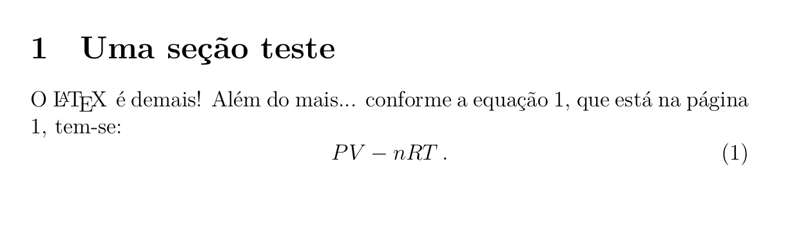

# O início

## 1. História do $\LaTeX$

O $\LaTeX$ (que se pronuncia *[''la:tec]* ou *['lei:tec]*) vem da junção no mome *Lamport* e do grego $\tau\, \epsilon\, \chi\, \nu\,\eta\,$ *[''tec:ni]* e que, etimologicamente, está nas origens do termo *técnica*. É, a grosso modo, uma Linguagem de Programação para marcação de texto, ou, mais à rigor, um *Interpretador*, que trabalha em cima de um arquivo de texto puro, fazendo algo bem próximo ao que um professor ou professora de línguas faria ao corrigir um texto: uma análise léxica, semântica e sintática, linha por linha , como:

    Início
       1. Colocar um titulo aqui.
       2. colocar um negrito na palavra tal;
       3. colocar tal letra em maíscula;
        etc.
    fim

A linguagem $\TeX$ foi uma criação de Donald Knuth, ao longo da recuada década de 1970, quando ainda não havia o computador pessoal, mas apenas grandes *workstations*, que ocupavam salas inteiras. Naquela época, Donald Knuth estava no processo de escrita e revisão de alguns livros de sua autoria, uma coleção em vários volumes chamada *The Art of Computer Programming*, quando recebeu uma amostra de prova preparada pela editora, que não o agradou em nada pelo resultado. Reza a lenda que, ao receber o manuscrito pelo correio, ele disse **Bleecc!!** (que seria no Português algo como **Eeeca!**) Daí a pronúncia **['lei:tec]**.

Naquela mesma época Knuth havia se deparado com um livro que se tornara popular,  [Artificial Intelligence](https://archive.org/details/artificialintell00wins), de Patrick Winston, que havia sido um dos primeiros livros  produzidos de maneira inteiramente digital, isto é, que utilizava *0's* (zeros) e *1's* (uns) em cada ponto de uma página para formar uma imagem, isto é "tinta=1", "não-tinta"=0. Impressionado, e como também era pesquisador da área de Computação, decidiu fazer algo similar.  

Antes de tudo ele precisava aprender do que se tratava um bom livro, quais eram as boas práticas, em termos tipográficos, para escrita de símbolos matemáticos, textos simples, questões estilísticas envolvidas no design de fontes, etc. Acreditando inicialmente que esta seria uma tarefa simples, que gastaria em torno de 6 meses, Knuth acabou dedicando 10 anos de sua vida para desenvolver o primeiro interpretador $\TeX$.

Um ano após ter iniciado sua pesquisa, Donald Kntuh foi convidado pela *AMS* (American Mathematical Society) para dar uma série de palestras no encontro anual da entidade, que organizava um evento para pessoas que haviam feito algo relevante para o campo da Matemática, mas que não haviam necessariamente trabalhando com matemática. Os convidados poderiam falar do que quisessem em suas palestras, e Knuth decidiu falar sobre a Ciência da Computação à serviço da matemática, apresentando seu novo projeto $\TeX$, para composição de textos e o *Metafont*, que era um projeto paralelo para desenhar fontes com o auxílio do $\TeX$.  Na palestra ele apresentou não apenas as raízes dos conceitos tipográficos, mas também as estruturas matemáticas sobre as quais o programa estava sendo desenvolvido. O $\TeX$ era então mais próximo a um projeto de pesquisa do que um produto de larga escala, mas isso estava para mudar. Mas antes de passarmos aos detalhes técnicos, façamos um panorama sobre as possibilidades do LaTeX

### Belos projetos em $\TeX$ , $\LaTeX$ e amigos...

1. Não se preocupe ainda com instalação de ferramentas. Antes de qualquer coisa,
   conheça o potencial do LaTeX:
   
   - [Belos projetos de diagramação](http://tex.stackexchange.com/questions/1319/showcase-of-beautiful-typography-done-in-tex-friends);
   - [Exemplos extremos das possibilidades do LaTeX](http://www.tug.org/texshowcase/).

### Premissas básicas de uma distribuição $\TeX$:

 Entre os objetivos iniciais do programa desenvolvido por Donald Knuth, o $\TeX$ deveria:

* Ser utilizado diretamente pelos autores, que são aqueles que mais entendem a respeito do que estão escrevendo;

* Servir aos propósitos de pesquisa acadêmica, sendo por sua natureza, um [Software Livre](https://pt.wikipedia.org/wiki/Software_livre), que não é a mesma coisa que "comida grátis";

* Ser desenvolvido de forma que os arquivos de entrada (textos simples com marcações) pudessem ser compatíveis com qualquer sistema operacional futuro, o que é bem diferente de um sistema [WYSWYG](https://en.wikipedia.org/wiki/WYSIWYG), como os atuais processadores de texto: em um programa dessa natureza, duas partes do mesmo texto podem ser bem diferentes, mesmo que se use os mesmos estilos de formatação e fontes. Por exemplo: um arquivo no MS Office 95 não será lido exatamente da mesma forma no MS Office 2020. Aliás, ainda que na mesma plataforma, eles são serão totalmente incompatíveis. Neste aspecto, um arquivo em $\TeX$ é sempre processado da mesma forma, não importando em qual sistema ele esteja. Um arquivo dos anos 1970 é executado perfeitamente em um computador moderno, apresentando a mesma qualidade;
  
  ### O $\LaTeX$
  
  Como o $\TeX$ formava um conjunto relativamente simples de comandos, como pequenos blocos fundamentais, rapidamente começaram a surgir complementos seguindo a [Licença Livre](https://en.wikipedia.org/wiki/LaTeX_Project_Public_License) sobre a qual o primeiro projeto havia sido desenvolvido.  Uma das premissas básicas da licença era que o nome $\TeX$ deveria aparecer em qualquer outra distribuição futura baseada em $\TeX$, ainda que a utilização de qualquer obra baseada nele pudesse ser utilizada papra qualquer fim, mesmo que comercial. Em 1983, Leslie Lamport desenvolveu uma série de macros (que são pequenas rotinas de instruções) utilizando os comandos básicos do $\TeX$, dando início à primeira versão do $\LaTeX$, que atualmente está em sua segunda versão. 
  
  ### Estrutura básica de um arquivo *.tex*

A estrutura básica de um arquivo em $\LaTeX$ é bem simples. Por exemplo, você digitar os comando em um arquivo de texto simples:

    \documentclass[a4paper,12pt]{article}
    \begin{document}
    Alô Mundo!
    \end{document}

Após a execução em um editor qualquer de texto, que vimos ao longo da oficina, o compilador vai gerar apenas um documento em branco com a frase "Alô Mundo!". Se quisermos algo um pouco mais detalhado, como um texto formatado, podemos fazer algo do tipo:

    \documentclass[a4paper,12pt]{article}
    \begin{document}
    \section{Uma seção teste}
    O \LaTeX é demais! além do mais... conforme a equação \ref{eq:01}, que está na página \pageref{eq:01}, tem-se: 
    
    \begin{equation}
        PV - nRT\,.
        \label{eq:01}
    \end{equation}
    
    \end{document}

Que deverá gerar algo como expresso na figura: 
Obviamente que eu ainda não disse como se dão os passos entre o arquivo de texto puro e o resultado. Mas quero, contudo, que você se atente aos elementos presentes nesta imagem e em seu potencial. Veja que com poucos comandos conseguimos um resultado simples, elegante e profissional para o pequeno texto. Em momento algum tivemos que nos preocupar em inserir campos para numeração da equação, tamanho das fontes ou símbolos em algum editor de equações.

> Agora é o momento de alguns passos para [instalação](2-instalacao-latex.md) do $\LaTeX$. Como não é o foco dessa oficina, vou me atentar apenas a algumas sugestões de instalação para os sistemas operacionais Linux, Windows, MacOS, e "Nuvem".
