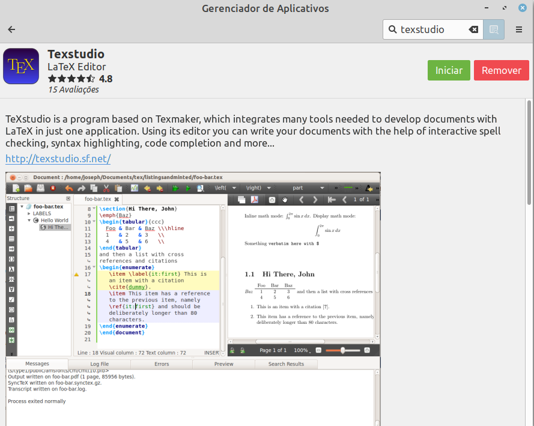
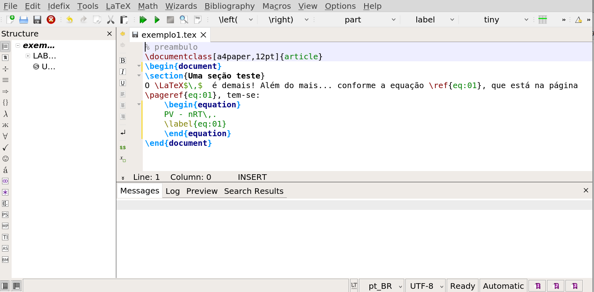
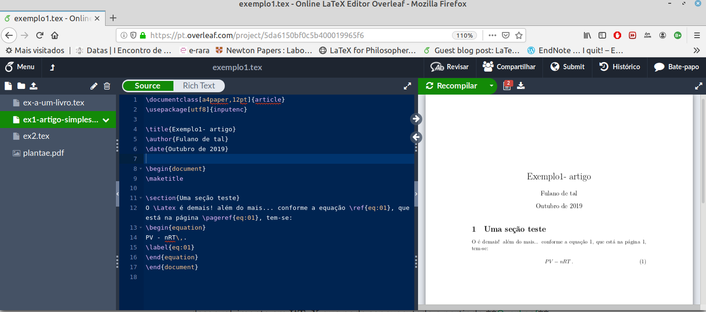

# 2. Instalação de um ambiente $\LaTeX$

Antes de continuarmos, falemos um pouco da instalação do ambiente de edição e das instalações nos diferentes sistemas. Como não é o foco dessa pequena oficina, vou me atentar somente a links com sugestões de instalação para os sistemas operacionais GNU/Linux, Windows, MacOS, e na Nuvem:

## **GNU/Linux**:

basta utilizar o gerenciador de aplicativos da sua distribuição Linux favorita e instalar os pacotes `texlive-fulll`, que reune todos os requisitos necessários para a utilização do \LaTeX. O texlive é a base sob a qual o sistema funciona. Como editor de texto, a sugestão é o `texstudio`:



Se prerefir utilizar a linha de comandos, entre com os comandos abaixo (o sistema irá pedir sua senha de supeprusuário depois do primeiro comando):

```
$ sudo su
# apt update && apt install texlive-full && apt install texstudio
```

Após isso basta abrir o editor de texto texstudio no seu menu de aplicativos e começar a utilizar o programa:



**É altamente recomendável** utilizar um sistema operacional GNU/Linux para rodar o $\LaTeX$. Quem tiver interesse, assistir o [tutorial de instalação](https://www.youtube.com/watch?v=WgJksOkfnTQ) de uma distribuição leve e intuitiva, o Linux Mint.

## Windows:

Há uma distribuição completa disponibilizada pelo TUG (TeX and friends) chamada [TeXLive](https://www.tug.org/texlive/windows.html) para o **"windows"**, que instala o TeXLive (conjunto de pacotes básicos) + o editor [TeXstudio - A LaTeX editor](https://www.texstudio.org/#home) .

## MacOs:

Há uma distribuição do TexLive para o MacOS, também disponibilizada pelo TUG chamada [MacTeX](https://tug.org/mactex/). Na página é possível encontrar instruções de instalação e download dos programas.

## Instalação em "Nuvem":

Uma evolução da computação foi certamente a possibilidade de execução de aplicatitvos em nuvem. Há um sistema completo de desenvolvimento em $\LaTeX$ que pode ser executado totalmente online, chamado **[OverLeaf](https://www.overleaf.com/)**. Embora não seja um sistema livre e de código aberto, o Overleaf possibilita a criação de projetos em \LaTeX totalmente sem cobranças, além de não ser necessária nenhuma instalação anterior. Basta criar uma conta e começar a utilizar! O sistema possui um editor de texto integrado com a exibição do `pdf` ao lado em tempo real. É muito útil para projetos colaborativos, pois é possível que várias pessoas, ao mesmo tempo, editem o arquivo `.tex`:


